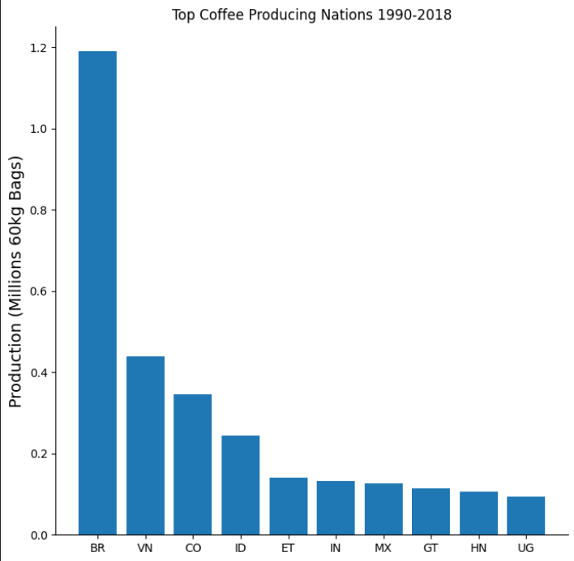

<div id="top"></div>

<div style="text-align:center"></div>

## 1. Introduction

### 1.1 Overview

Coffee is a globally traded commodity that is produced in over 60 countries and
consumed in virtually every corner of the world. As a result, the coffee market
is a complex and dynamic system that is influenced by a range of factors,
including production, consumption, import and export volumes, and prices.


This project aims to analyze the global coffee market using data analysis
techniques. The project has collected data on coffee production from 56 nations,
as well as data on the 29 nations that import coffee. Additionally, data on
coffee prices and consumption patterns have been obtained. By analyzing these
data sets, the project aims to provide insights into the largest
coffee-producing and consuming nations, as well as the largest importing
nations. The project also aims to examine how coffee prices and consumption
patterns vary over time.


A key objective of this project is to identify the importing nation that
consumes the most coffee. This information will provide an understanding of
which markets are most significant for coffee exporters and which nations are
likely to have the most substantial impact on coffee prices. Moreover, the
project aims to pick one nation from this dataset to examine its status in the
coffee market, including production levels, export volumes, and prices.


To perform the data analysis, the project utilizes the Python programming
language and various libraries, including Pandas, NumPy, and Matplotlib. These
tools enable manipulation and visualization of data in a variety of ways,
allowing for deeper insights into the coffee market.


Overall, this project provides a comprehensive overview of the global coffee
market and the factors that affect it. By doing so, the project aims to
illuminate this important commodity's role in the global economy.

### 1.2 Libraries

- [NumPy](https://numpy.org/)
- [Matplotlib](https://matplotlib.org/)
- [pandas](https://pandas.pydata.org/)


## 2. Production Analysis

### 2.1 Top 10 Producers

Listing the top 10 by adding all production. Brazil is leading the market.


| Country   | Value        |
| --------- | ------------ |
| Brazil    | 1190965.7353 |
| Viet Nam  | 439540.9519  |
| Colombia  | 345871.4464  |
| Indonesia | 245116.7707  |
| Ethiopia  | 141542.8931  |
| India     | 132025.681   |
| Mexico    | 126908.2467  |
| Guatemala | 113401.0702  |
| Honduras  | 105456.5888  |
| Uganda    | 93146.369    |

---

### 2.2 Top Coffee Producing Nations between 1998-2018

<p align="center">
  
</p>

Display the production in millions with shortened labels.

```python
ax.bar(x=top10_producers.index, height=top10_producers / 1000000)
```

---

### 2.3 Top 5 Nations Over Time


| total_production | Brazil     | Viet Nam | Colombia  | Indonesia | Ethiopia |
| ---------------- | ---------- | -------- | --------- | --------- | -------- |
| 1990-01-01       | 27285.6286 | 1310.288 | 14396.0   | 7441.383  | 2909.451 |
| 1991-01-01       | 27293.4934 | 1437.848 | 17980.397 | 8493.196  | 2924.664 |
| 1992-01-01       | 34603.3542 | 2340.447 | 14946.878 | 5569.478  | 1825.171 |
| 1993-01-01       | 28166.9786 | 3020.216 | 11422.422 | 6743.288  | 2967.004 |
| 1994-01-01       | 28192.047  | 3631.609 | 12964.0   | 5367.878  | 2762.73  |

---

### 2.4 Top 5 Nations Visualized

<p align="center">
  
</p>

Brazil kept its gradual growth over time. Vietnam improved by 3 places, however
there is still a huge gap to Brazil. Brazil is dominating by a large margin up
to 2018.


---

### 2.5 Brazil vs the World

Brazil dominates the market, but by how much?

<p align="center">
  
</p>

The graph displays how Brazil shapes the global production. Every increase in
Brazil's production shows a steep incline the world's production. Until the
2010s, every delta in Brazil easily affected world production. However, after
2012 other nations bumped up the production while Brazil was idling.

---

### 2.6 Venezuala vs Brazil Scatterplot

<p align="center">
  
</p>


---

### 2.7 Vietnam vs Brazil Scatterplot

<p align="center">
  
</p>

---

### 2.8 Compostion

<p align="center">
  
</p>


### 2.9 Brazil vs Globe in 1990

<p align="center">
  
</p>


### 2.10 Brazil vs Globe in 2018

<p align="center">
  
</p>

> 9% increase in 28 years.

---

## 3. Consumption Analysis

### 3.1 Prices Paid vs Consumption on Importing Countries


<p align="center">
  
</p>


<!-- CONTACT -->
## 4. Contact

Erol Gelbul - [Website](http://www.erolgelbul.com)

Project Link: [Global Coffee Market](https://github.com/ErolGelbul/global_coffee_market)

<p align="right">(<a href="#top">back to top</a>)</p>

